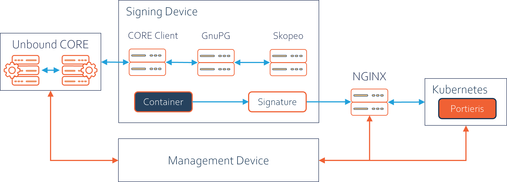

# Unbound CORE Integration with Skopeo and Portieris

This integration uses Unbound CORE and Skopeo to sign a container and then IBM Portieris to verify the signature before running the container in a Kubernetes cluster.



The system has the following parts:

1. [Skopeo](https://github.com/containers/skopeo) - a container copying and signing command line tool.
1. [Portieris](https://github.com/IBM/portieris) - a Kubernetes service that blocks unauthorized containers from starting.
1. [Unbound CORE](https://www.unboundsecurity.com/) - Unbound's key management tool.
2. [NGINX](https://www.nginx.com/) – a webserver used to store container signatures.


The integration is described using 2 devices:

1. Management Device - used to configure the system.
1. Signing Device - used to sign containers.


## Integration Overview

All the relevant tools must be configured to work together. 

First, the following steps are executed one time.
1. Generate an RSA key pair used to sign containers in Unbound CORE.
1. Export the public pair of the signing key (generated in step 1).
1. Store the public key (generated in step 2) as a secret in the Kubernetes cluster.
1. Configure ``skopeo`` to work with Unbound CORE (using gpg).
1. Generate ``portieris`` template to validate all containers for signatures in the NGINX server.
1. Start ``portieris`` and check that everything is working and container signatures are enforced.

Second, the following steps are executed for every new container on the **signing device**.
1. Sign a container and generate the signature file using the ``skopeo`` command.
1. Copy the generated signature file to the ``NGINX`` web server used to serve static files.

## Prerequisites
You need to have a running Unbound CORE and [generate an RSA key](https://www.unboundsecurity.com/docs/UKC/UKC_Interfaces/Content/Products/UKC-EKM/UKC_User_Guide/UG-If/cliKeyManagement/uclGenerate.html#h3_4) that will be used for signing.


## On the Management Device

1. Export the public key from CORE. See [here](https://www.unboundsecurity.com/docs/UKC/UKC_Interfaces/Content/Products/UKC-EKM/UKC_User_Guide/UG-If/cliKeyManagement/uclExport.html#h3_5) for the command.
1. Create a Kubernetes secret from the ```public.gpg``` file.
    ```
    kubectl create secret generic signing-pubkey --from-file=key=public.gpg
    ```

1. Start the **nginx** container to serve static signatures.
    ```
    docker run --rm  -v `pwd`/sigstore:/usr/share/nginx/html --name nginx -p 1280:80 -d nginx
    ```

1. Download and prepare portieris as described [here](https://github.com/IBM/portieris).
    ```
    sh ./portieris/gencerts
    ```

1. Edit ```portieris/templates/policies.yaml```.

    Change the last policy to be similiar to:

    ```
    apiVersion: portieris.cloud.ibm.com/v1
    kind: ClusterImagePolicy
    metadata:
      name: default
      annotations:
        helm.sh/hook: post-install
        helm.sh/hook-weight: "1"
    spec:
       repositories:
         - name: '*'
           policy:
             simple:
               storeURL: http://host.docker.internal:1280
               requirements:
                 - type: "signedBy"
                   keySecret: signing-pubkey
    ```

    The ```storeURL``` should point to the webserver used to host container signatures. 
    This url is used to point to NGINX (listening on port 1280) and downloads the signatures. 
    The *keySecret* specifies the name of the public key, so that signatures can be verified.

1. Install the kubernetes portieris service. It blocks all unsigned containers.
    ```
    helm install portieris --create-namespace --namespace portieris ./portieris --set IBMContainerService=false --debug
    ```


## On the Signing Device
This step can be done with a Docker container.

1. Install all required packages (OpenSSL, Java, wget, GPG, and skopeo). For example, on CentOS 8:
    ```
    yum -y install jq less vim openssl java java-devel wget gpg
    RUN dnf -y install skopeo
    ```

1. Upload the *ekm-client.rpm* file to the device.

1. Install and configure the CORE ekm-client using the instructions found [here](https://www.unboundsecurity.com/docs/UKC/UKC_Installation/Content/Products/UKC-EKM/UKC_User_Guide/UG-Inst/ClientInstallation.html).
1. Use the following command to load the certificate from Unbound and make it available for GPG2:
    ```
    ucl pgp-key -p $PARTITION -n $KEY_NAME
    ```

1. Create an RSA key that is used for signing. See [here](https://www.unboundsecurity.com/docs/UKC/UKC_Interfaces/Content/Products/UKC-EKM/UKC_User_Guide/UG-If/cliKeyManagement/uclGenerate.html#h3_4) for details.
1. Export public key in pgp format and copy it to the device used to manage Kubernetes.

    ```
    gpg2 --armor --output /tmp/public.gpg --export $KEY_NAME
    scp /tmp/public.gpg management-box:
    ```

Next, for each container, sign the container (using Skopeo) and upload the signature file to the NGINX server.

By default, on **CentOS 8** the container signatures are saved to the following directory: ```/var/lib/containers/sigstore```.
You need to copy the signatures directory to the NGINX server.

```
PUBID=$(gpg --list-keys 2>/dev/null | sed -n -e  's/^ * //p')
skopeo copy --sign-by $PUBID docker://docker.io/library/busybox:latest \
  docker://docker.io/stremovsky/busybox:latest --override-os linux --dest-creds stremovsky:PASSWORD
scp /var/lib/containers/sigstore NGINX:
```


## Test the System

1. Run a container that we already signed. It runs without any issues.
    ```
    kubectl run -i --tty busybox --image=stremovsky/busybox:latest --restart=Never -- sh
    ```
1. Run an unsigned container. It is blocked from running.
    ```
    kubectl run -i --tty busybox --image=library/busybox:latest --restart=Never -- sh
    ```

    Sample response:
    ```
    Error from server: admission webhook "trust.hooks.securityenforcement.admission.cloud.ibm.com" denied the request:
    simple: policy denied the request: A signature was required, but no signature exists
    ```
    
